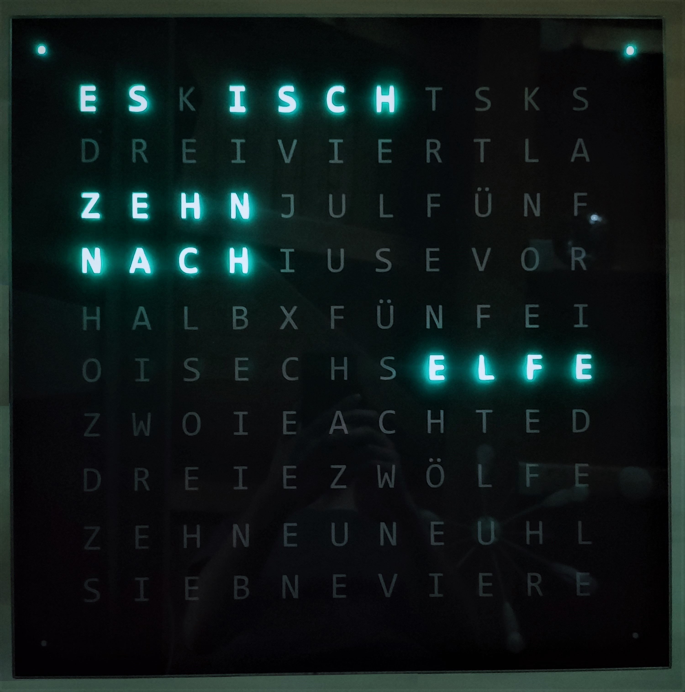

# QlockToo
Replica of <a href="https://qlocktwo.com/de/stores">QlockTwo</a> using Arduino.  

 QlockToo needs your Wi-Fi credentials for remote control and autonomous time synchronizing.
 When the QlockToo is disconnected during the day, it will open an access point named “QlockToo” with password “QlockToo”.
 After successfully entering the Wi-Fi credentials, the access point will be closed.
 You should then be able to access your QlockToo by http://qlocktoo or http://qlocktoo.fritz.box (tested with FritzBox 7412 and 7530).
 Before entering the website, you will be asked to enter a username and a password. Again, enter “QlockToo” as username and password.

## Required Libraries and Tools
 - <a href="https://randomnerdtutorials.com/installing-the-esp32-board-in-arduino-ide-windows-instructions/">Install the ESP32 board</a>
 - <a href="https://randomnerdtutorials.com/install-esp32-filesystem-uploader-arduino-ide/">Install the ESP32 filesystem uploader</a>
 - Install the packed libraries in `/libraries` folder

## Arduino-IDE Settings
 - Board: DOIT ESP32 DevKit V1 </li>
 - Upload Speed: 921600 </li>
 - Flash Frequency: 80 MHz </li>
 - Core Debug Level: None </li>
 
## Code Customization
- **Change language**   
    Include `GermanDisplay.h` or `SwabianDisplay.h` in `QlockToo.ino`.  
    Declare `GermanDisplay` or `SwabianDisplay` accordingly.  
- **Select specials**  
   Open `Specials.h` and adjust the `specials` map.  
   The website will contain all chosen special names in its selection.
- **Name and password**  
   When two QlockToo's are used in the same network, you have to rename your QlockToo.  
   Otherwise, you can't access your qlocks by name (since it would be ambiguous).  
   Open `data/config.json` and edit the `qlock_name` and `qlock_password` fields.  
