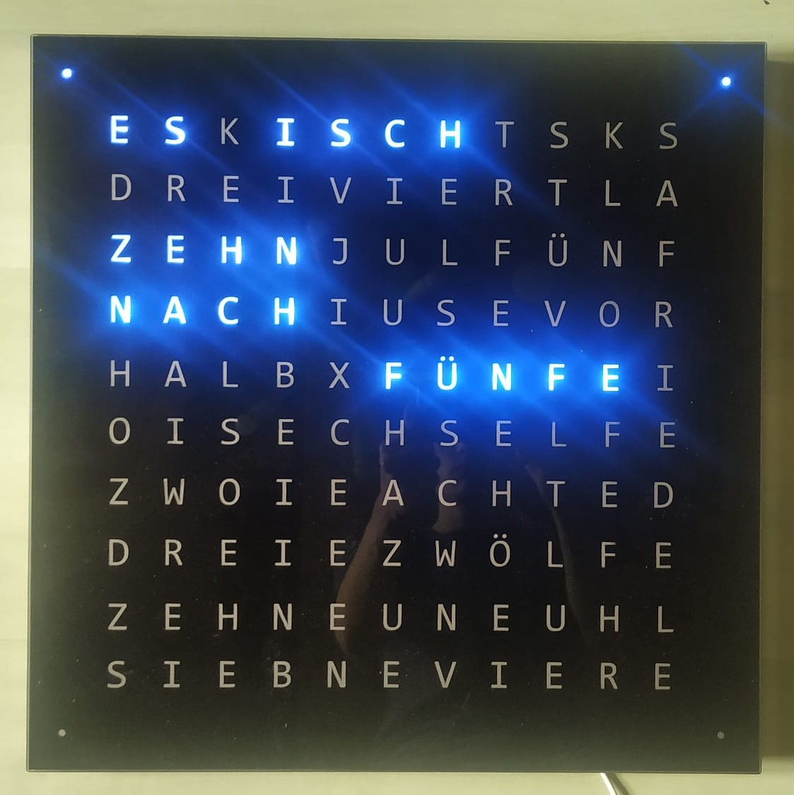
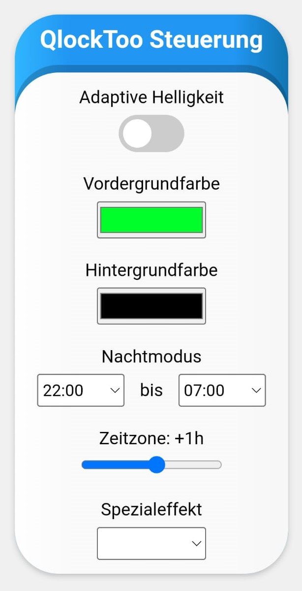

# QlockToo
Replica of <a href="https://qlocktwo.com/de/stores">QlockTwo</a> with an ESP32 which is controlled by a website.

In 2017 my friends started this project at the EULE in Schwäbisch Gmünd.  
Later, in 2021, one of them developed it further, using a glass plate as a display, for example.  
In 2022, I participated by extending and refactoring the sketches located in the doc folder.

## Setup Instructions
QlockToo needs your Wi-Fi credentials for website control and automatic time synchronization.
If QlockToo is not connected or not set up, it opens an access point with the clock's name and password.
The name and password are set in data/config.json and are "QlockToo" and "QlockToo" by default. 
While connecting to the access point, most devices (tested on Android and Windows) detect the Captive 
Portal and automatically open a website, where you can enter the WiFi credentials. 
After entering valid credentials, the access point and website are closed. 
While your QlockToo is connected, you should be able to access it by its name in your home network, 
for example http://qlocktoo or http://qlocktoo.fritz.box (tested with FritzBox 7412 and 7530). 
Before accessing the website, you'll have to enter the clock's name and password.

## Development Setup And Upload
Install the libraries and tools below:
 - <a href="https://randomnerdtutorials.com/installing-the-esp32-board-in-arduino-ide-windows-instructions/">ESP32 board</a>
 - <a href="https://randomnerdtutorials.com/install-esp32-filesystem-uploader-arduino-ide/">ESP32 file system uploader</a>
 - Packed libraries in `/libraries` folder

Select following board settings in your Arduino IDE:
 - Board: DOIT ESP32 DevKit V1 </li>
 - Upload Speed: 921600 </li>
 - Flash Frequency: 80 MHz </li>
 - Core Debug Level: None </li>

Then connect the ESP32 via a data cable and press upload.  
If you see the pattern "____....._____.....", you have to press the boot button.
 
## Code Customization
- **Change language**   
    Include `GermanDisplay.h` or `SwabianDisplay.h` in `QlockToo.ino`.  
    Instantiate `GermanDisplay` or `SwabianDisplay` accordingly.  
    A flag can be passed to `GermanDisplay` to determine whether “dreiviertel” or “viertel vor” is used.
- **Configure special patterns (heart and names)**  
   Open `Specials.h` and adjust the `specials` map.  
   The website will automatically contain all chosen special names in its selection.
- **Name and password**  
   When two QlockToo's are used in the same network, you have to rename your QlockToo.  
   Otherwise, you can't access your qlocks by name (since it would be ambiguous).  
   Open `data/config.json` and edit the `qlock_name` and `qlock_password` fields.  
